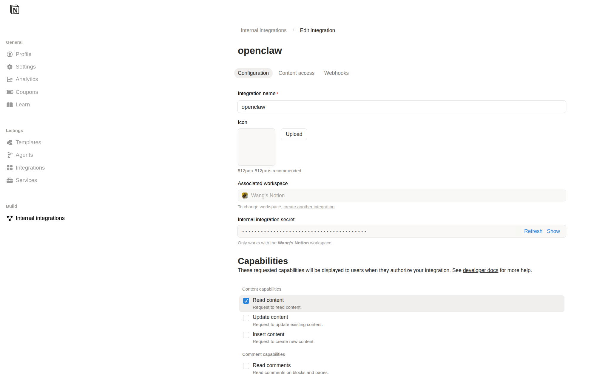
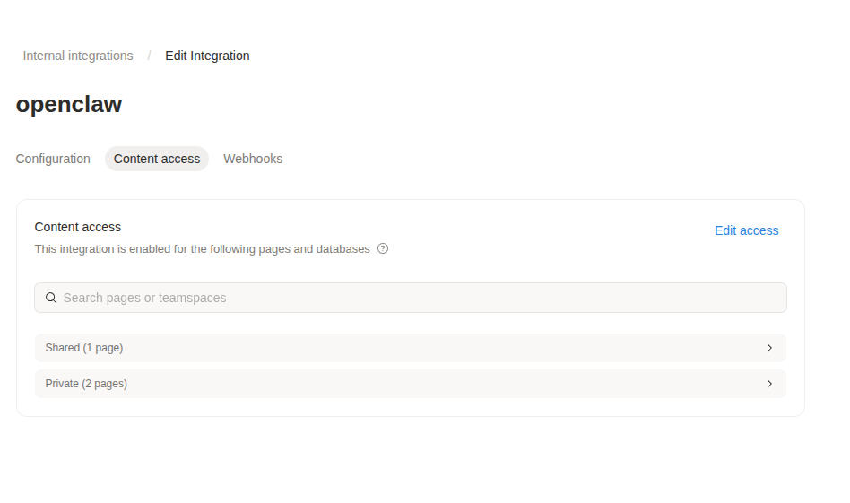

# notion-to-obsidian

Two-way sync between Notion and Obsidian/Markdown.

- **`notion_to_obsidian.py`** — Export a Notion page (and all sub-pages) to clean Markdown files, with images downloaded locally
- **`obsidian_to_notion.py`** — Import Markdown / Obsidian notes back into Notion as child pages, preserving folder structure

---

## Features

### Notion → Obsidian
- Recursively exports all child pages in the exact order they appear in Notion
- Downloads and saves all images locally (Notion's S3 URLs expire after 1 hour)
- Converts all Notion block types to standard Markdown:
  - Headings, paragraphs, bullet/numbered lists, to-do checkboxes
  - Tables, code blocks, quotes, callouts, toggles, dividers
  - Bookmarks, embeds, videos
  - Obsidian-style wikilinks (`[[Page Name]]`) for child page references
- Files are numbered (`01_`, `02_`, ...) to preserve Notion page order

### Obsidian → Notion
- Imports `.md` files from an Obsidian vault folder or any local directory
- Preserves folder structure — subfolders become nested Notion pages
- Strips YAML frontmatter automatically
- Converts Obsidian callouts (`> [!type]`) to Notion quote blocks
- Supports tables, code blocks (with language normalization), wikilinks, images, bookmarks

---

## Requirements

- Python 3.9+
- A [Notion integration](https://www.notion.so/my-integrations) with access to your pages
- [uv](https://github.com/astral-sh/uv) (recommended) or pip

---

## Installation

```bash
git clone https://github.com/yourname/notion-to-obsidian.git
cd notion-to-obsidian

# with uv (recommended)
uv sync

# or with pip
pip install requests python-dotenv
```

---

## Setup

### 1. Create a Notion Integration

1. Go to [notion.so/my-integrations](https://www.notion.so/my-integrations)
2. Click **New integration**, give it a name, and save

   

3. Copy the **Internal Integration Secret** (starts with `ntn_` or `secret_`)

   

### 2. Share your Notion pages with the integration

1. Open each Notion page you want to export or import into
2. Click `...` → **Connections** → select your integration

   

3. Copy the **Page ID** from the URL:
   ```
   https://notion.so/My-Page-2dab3fe452e5806da040c424f49bf971
                      ^^^^^^^^^^^^^^^^^^^^^^^^^^^^^^^^
                                this is your PAGE_ID
   ```

### 3. Configure `.env`

```env
NOTION_API_KEY=ntn_your_integration_key_here

# For notion_to_obsidian.py
NOTION_PAGE_ID=your_export_page_id_here

# For obsidian_to_notion.py
NOTION_PARENT_PAGE_ID=your_import_parent_page_id_here

# Obsidian vault settings (used by both scripts)
OBSIDIAN_VAULT_PATH=/absolute/path/to/your/vault
OBSIDIAN_FOLDER_NAME=Notion Import
```

> **Tip:** `OBSIDIAN_VAULT_PATH` should point to the vault root (e.g. `~/Documents/MyVault`), not the `.obsidian` folder inside it.

---

## Usage

### notion_to_obsidian.py — Export Notion → Obsidian

```bash
# Use .env settings
uv run notion_to_obsidian.py

# Save to a local folder instead of Obsidian
uv run notion_to_obsidian.py --output ./output

# Override any value inline
uv run notion_to_obsidian.py --key ntn_xxx --page abc123 --output ./my_notes
```

**All flags:**

| Flag | Description | Default |
|------|-------------|---------|
| `--key` | Notion API key | `NOTION_API_KEY` in `.env` |
| `--page` | Notion page ID to export | `NOTION_PAGE_ID` in `.env` |
| `--vault` | Obsidian vault root path | `OBSIDIAN_VAULT_PATH` in `.env` |
| `--folder` | Folder name inside vault | `OBSIDIAN_FOLDER_NAME` in `.env` |
| `--output` | Save to this local path (skips vault) | — |

---

### obsidian_to_notion.py — Import Obsidian → Notion

```bash
# Use .env settings (reads from OBSIDIAN_VAULT_PATH/OBSIDIAN_FOLDER_NAME)
uv run obsidian_to_notion.py

# Import from a specific local folder
uv run obsidian_to_notion.py --input ./my_notes

# Override parent page
uv run obsidian_to_notion.py --input ./my_notes --parent abc123pageId
```

**All flags:**

| Flag | Description | Default |
|------|-------------|---------|
| `--key` | Notion API key | `NOTION_API_KEY` in `.env` |
| `--parent` | Target Notion parent page ID | `NOTION_PARENT_PAGE_ID` in `.env` |
| `--vault` | Obsidian vault root path | `OBSIDIAN_VAULT_PATH` in `.env` |
| `--folder` | Folder name inside vault | `OBSIDIAN_FOLDER_NAME` in `.env` |
| `--input` | Import from this local directory | — |

**Folder structure is preserved:**

```
my_notes/
├── file1.md          → created under parent page
├── file2.md          → created under parent page
└── subfolder/
    ├── file3.md      → created under "subfolder" page
    └── file4.md      → created under "subfolder" page
```

---

## Output Structure (notion_to_obsidian.py)

```
<destination>/
├── 01_Page Title One.md
├── 02_Page Title Two.md
├── 03_Page Title Three.md
└── images/
    ├── abc123def456.png
    └── 789ghi012jkl.jpg
```

---

## Block Support

### notion_to_obsidian.py

| Notion Block | Markdown Output |
|---|---|
| Paragraph | Plain text |
| Heading 1 / 2 / 3 | `#` / `##` / `###` |
| Bulleted list | `- item` |
| Numbered list | `1. item` |
| To-do | `- [ ] task` / `- [x] done` |
| Toggle | `- item` (children indented) |
| Quote | `> text` |
| Callout | `> emoji text` |
| Code | ` ```lang ``` ` |
| Divider | `---` |
| Table | Markdown table |
| Image | `` |
| Bookmark | `[label](url)` |
| Child page | `[[Page Title]]` |
| Embed / Video | `[embed](url)` |

### obsidian_to_notion.py

| Markdown | Notion Block |
|---|---|
| `#` / `##` / `###` | Heading 1 / 2 / 3 |
| Plain paragraph | Paragraph |
| `- item` / `* item` | Bulleted list |
| `1. item` | Numbered list |
| `- [ ] task` / `- [x] done` | To-do |
| `> text` | Quote |
| `> [!type] text` | Quote (callout prefix stripped) |
| ` ```lang ``` ` | Code (language normalized) |
| `---` | Divider |
| Markdown table | Table |
| `` | Image (external) |
| `[label](https://...)` standalone | Bookmark |
| `[[Page Name]]` | Link to imported page |
| YAML frontmatter | Stripped automatically |

---

## Notes

- **Image expiry:** Notion's hosted image URLs expire after 1 hour. `notion_to_obsidian.py` downloads every image at export time so they remain accessible permanently.
- **Rate limits:** Notion's API allows ~3 requests/second. For large vaults the scraper may slow down automatically.
- **Re-running exports:** Re-running `notion_to_obsidian.py` overwrites existing files, so it doubles as a sync/refresh tool.
- **Import creates new pages:** `obsidian_to_notion.py` always creates new child pages — it does not diff or update existing ones.

---

## License

MIT
