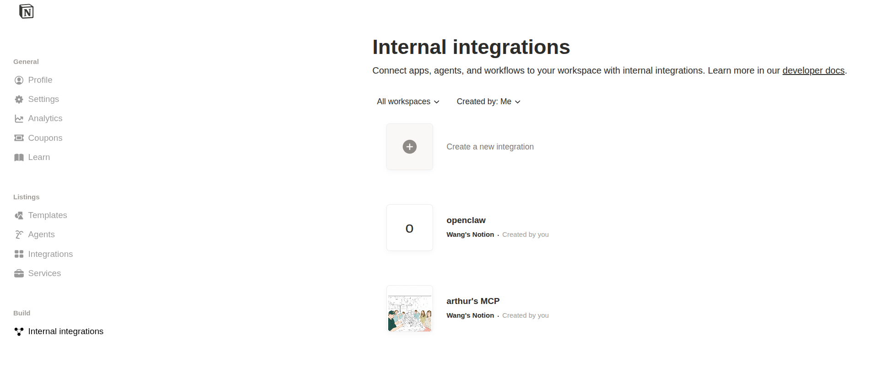

# notion-to-obsidian

Export an entire Notion page (and all its sub-pages) to clean Markdown files, with images downloaded locally. Files can be saved directly into your Obsidian vault or any local folder.

---

## Features

- Recursively exports all child pages in the exact order they appear in Notion
- Downloads and saves all images locally (Notion's S3 URLs expire after 1 hour)
- Converts all Notion block types to standard Markdown:
  - Headings, paragraphs, bullet/numbered lists, to-do checkboxes
  - Tables, code blocks, quotes, callouts, toggles, dividers
  - Bookmarks, embeds, videos
  - Obsidian-style wikilinks (`[[Page Name]]`) for child page references
- Saves directly into your Obsidian vault folder
- Configuration via `.env` file with CLI flag overrides
- Files are numbered (`01_`, `02_`, ...) to preserve Notion page order

---

## Requirements

- Python 3.9+
- A [Notion integration](https://www.notion.so/my-integrations) with access to your page
- [uv](https://github.com/astral-sh/uv) (recommended) or pip

---

## Installation

```bash
git clone https://github.com/yourname/notion-to-obsidian.git
cd notion-to-obsidian

# with uv (recommended)
uv sync

# or with pip
pip install requests python-dotenv
```

---

## Setup

### 1. Create a Notion Integration

1. Go to [notion.so/my-integrations](https://www.notion.so/my-integrations)
2. Click **New integration**, give it a name, and save

   

3. Open the integration and copy the **Internal Integration Secret** (starts with `ntn_` or `secret_`)

   

### 2. Share your Notion page with the integration

1. Open the Notion page you want to export
2. Click the `...` menu → **Connections** → select your integration
3. Copy the **Page ID** from the URL:
   ```
   https://notion.so/2026-2dab3fe452e5806da040c424f49bf971
                          ^^^^^^^^^^^^^^^^^^^^^^^^^^^^^^^^
                                    this is your PAGE_ID
   ```

### 3. Configure `.env`

Copy the example and fill in your values:

```bash
cp .env.example .env
```

```env
NOTION_API_KEY=ntn_your_integration_key_here
NOTION_PAGE_ID=your_page_id_here

# Obsidian vault settings
OBSIDIAN_VAULT_PATH=/absolute/path/to/your/vault
OBSIDIAN_FOLDER_NAME=Notion Import
```

> **Tip:** `OBSIDIAN_VAULT_PATH` should point to the vault root folder (e.g. `~/Documents/MyVault`), not the `.obsidian` config folder inside it.

---

## Usage

### Save to Obsidian (reads from `.env`)

```bash
python main.py
```

Output goes to `<OBSIDIAN_VAULT_PATH>/<OBSIDIAN_FOLDER_NAME>/`.

### Save to a local folder instead

```bash
python main.py --output ./output
```

### Override any `.env` value via flags

```bash
# different page
python main.py --page abc123pageId

# different vault or folder
python main.py --vault /path/to/vault --folder "Stock Notes"

# provide everything inline (no .env needed)
python main.py --key ntn_xxx --page abc123 --output ./my_notes
```

### All flags

| Flag | Description | Default |
|------|-------------|---------|
| `--key` | Notion API key | `NOTION_API_KEY` in `.env` |
| `--page` | Notion page ID | `NOTION_PAGE_ID` in `.env` |
| `--vault` | Obsidian vault root path | `OBSIDIAN_VAULT_PATH` in `.env` |
| `--folder` | Folder name inside vault | `OBSIDIAN_FOLDER_NAME` in `.env` |
| `--output` | Save locally to this path (skips Obsidian) | — |

---

## Output Structure

```
<destination>/
├── 01_Page Title One.md
├── 02_Page Title Two.md
├── 03_Page Title Three.md
├── ...
└── images/
    ├── abc123def456.png
    ├── 789ghi012jkl.jpg
    └── ...
```

- Each child page becomes its own numbered `.md` file
- All images are downloaded to `images/` and referenced with relative paths
- Wikilinks (`[[Title]]`) are used for cross-references between pages

---

## Block Support

| Notion Block | Markdown Output |
|---|---|
| Paragraph | Plain text |
| Heading 1 / 2 / 3 | `#` / `##` / `###` |
| Bulleted list | `- item` |
| Numbered list | `1. item` |
| To-do | `- [ ] task` / `- [x] done` |
| Toggle | `- item` (children indented) |
| Quote | `> text` |
| Callout | `> emoji text` |
| Code | ` ```lang ``` ` |
| Divider | `---` |
| Table | Markdown table |
| Image | `` |
| Bookmark | `[label](url)` |
| Child page | `[[Page Title]]` |
| Embed / Video | `[embed](url)` |

---

## Notes

- **Image expiry:** Notion's hosted image URLs expire after 1 hour. This tool downloads every image at scrape time so they remain accessible permanently.
- **Rate limits:** Notion's API allows ~3 requests/second. For very large vaults (hundreds of pages), the scraper may slow down automatically due to rate limiting.
- **Re-running:** Re-running the script overwrites existing files in the destination folder, so it also works as a sync/refresh tool.

---

## License

MIT
